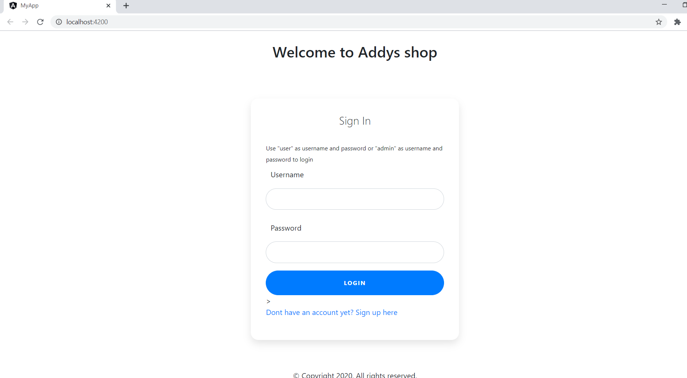
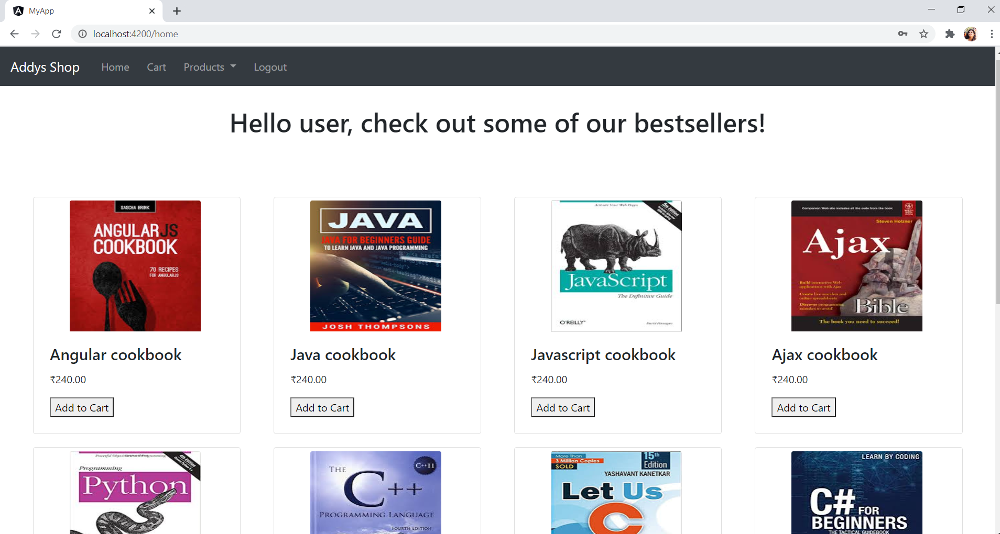
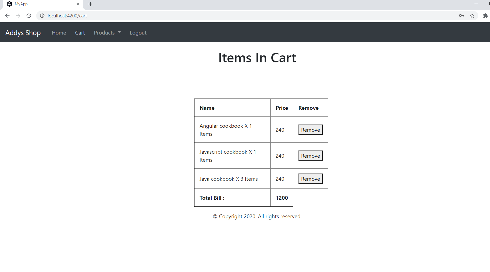
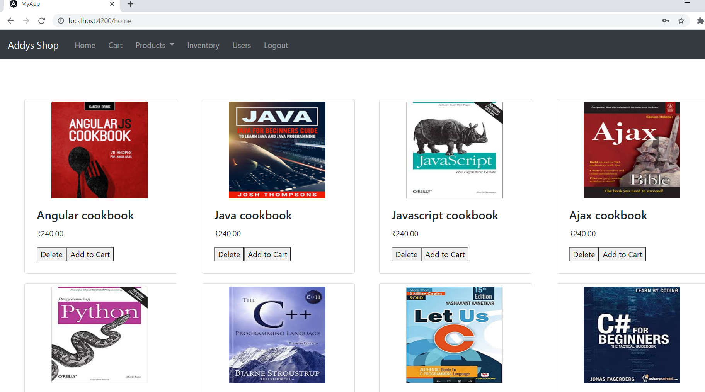
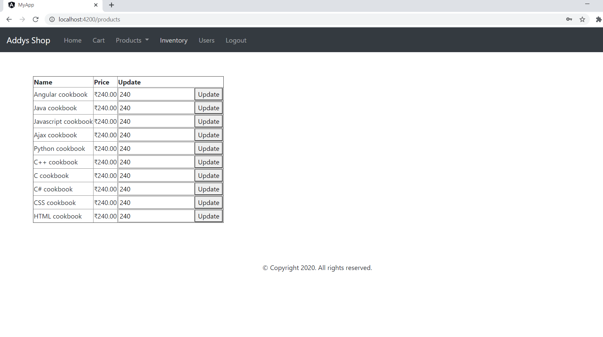
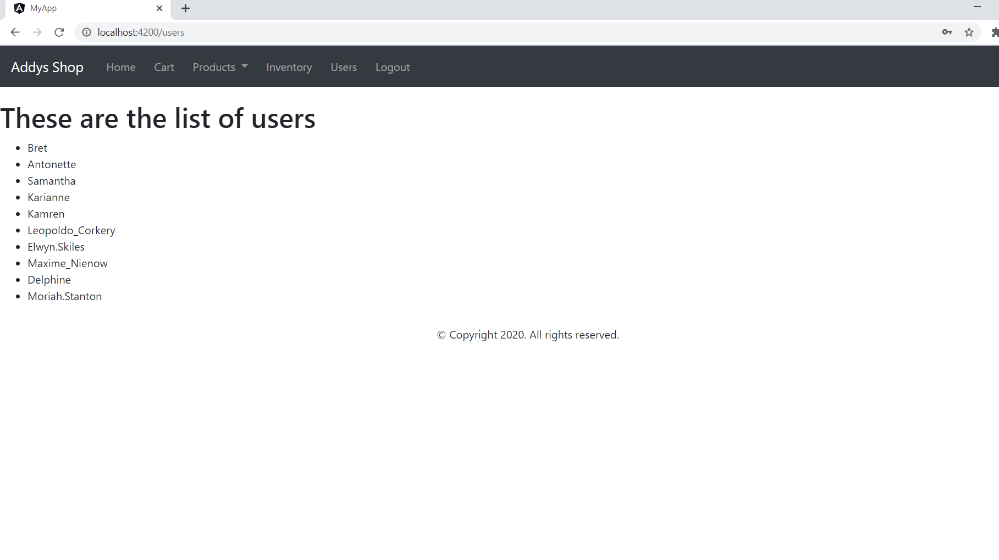

# Addy's Shop

It is a simple online shopping application. User can view products, add to cart, view bill and checkout.
Admin can view inventory, delete products and also update product price.
This application was built using Angular9, CSS and Bootstrap and AJAX.
It uses AJAX to fetch user data from a dummy json site.

## User

To login as user use "user" as username and password

Login Page

Home Page

Cart

## Admin

To login as admin, use "admin" as username and password.

Admin Home Page

Update Price

View Users

## Development server

Run `ng serve` for a dev server. Navigate to `http://localhost:4200/`. The app will automatically reload if you change any of the source files.

## Running unit tests

Run `ng test` to execute the unit tests via [Karma](https://karma-runner.github.io).
